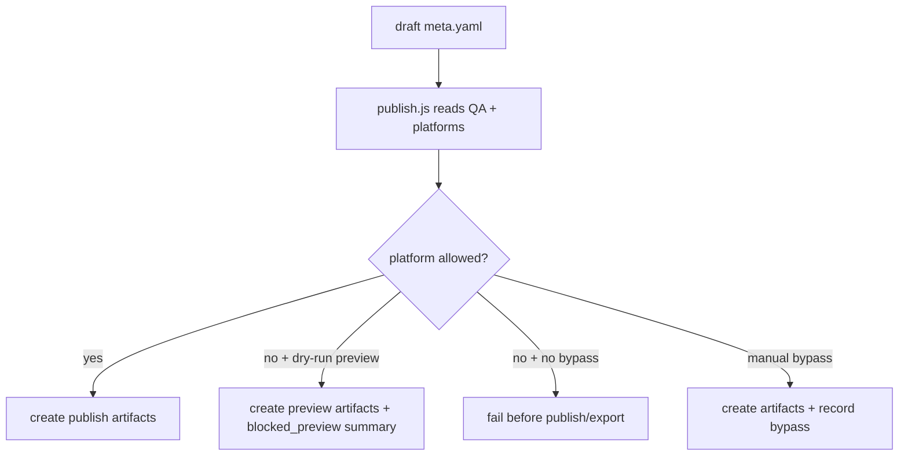
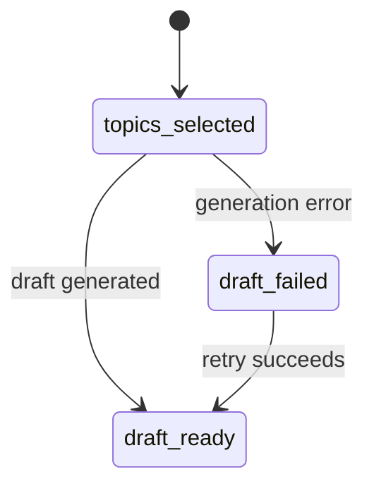

# feat: Add meta-first publish gate and daily run manifest

## Summary

Plan the smallest safe control-plane upgrade for PromptIO: first enforce a meta-first publish gate from `meta.yaml`, then add a lightweight `runs/{date}/manifest.json` for daily selection and draft recovery. The manifest records daily run state, while publish safety remains driven by draft metadata so legacy drafts are not blocked only because no manifest exists.

---

## Problem Frame

PromptIO already writes useful draft metadata in `meta.yaml`, including QA and platform fields, but `scripts/publish.js` can still build publish artifacts without enforcing those fields. The daily flow also lacks a durable run record, so selection, draft success, and draft failures are spread across `topics/{date}.json`, `drafts/{date}/...`, and logs.

The first implementation should reduce publish risk before adding workflow state. Story Package, Claim Ledger, Wiki Patch Queue, and full external source preflight remain follow-up work.

---

## Requirements

**Publish safety**

- R1. `scripts/publish.js` derives platform permission from `meta.yaml` before creating publishable artifacts.
- R2. A draft passes the normal gate only when QA passes and the requested platform is explicitly allowed.
- R3. Legacy or incomplete drafts can proceed only through an explicit manual bypass that is visible in the publish summary.
- R4. Dry-run preview can still generate local artifacts for inspection, but the summary must mark blocked drafts as non-publishable.

**Run manifest**

- R5. `scripts/daily.js` can create and update `runs/{date}/manifest.json` with deterministic JSON and repo-relative paths.
- R6. The manifest records selected topics, draft-ready paths, draft failures, and simple source counts.
- R7. Re-running a date reuses the existing manifest without silently overwriting completed topic state.
- R8. Existing `topics/{date}.json`, `drafts/{date}/...`, and logs remain compatible.

**Quality and operability**

- R9. Unit tests cover publish allow/block/bypass behavior and dry-run preview semantics.
- R10. Unit tests cover manifest creation, topic upsert, draft-ready, draft-failed, and path portability.
- R11. Documentation explains the gate, bypass, manifest file, and retry workflow.

---

## High-Level Technical Design

### Publish gate first

### Lightweight daily manifest

The manifest is run recovery state, not the source of publishing truth. Markdown drafts and `meta.yaml` remain the publishing contract.

---

## Key Technical Decisions

- KTD1. **Make publish gate meta-first:** `meta.yaml` is the canonical draft-level truth for QA and platform permission; a missing manifest should not block a draft that has complete metadata.
- KTD2. **Allow dry-run preview with blocked status:** dry-run remains useful for inspection, but its summary must say whether the result is publishable.
- KTD3. **Keep manifest schema small:** first version records date, simple source counts, selected topics, draft paths, errors, and events only.
- KTD4. **Do not add future evidence fields yet:** Story Package, Claim Ledger, and Wiki Patch belong in documentation as future extensions until current code consumes them.
- KTD5. **Use one manifest helper:** centralizing JSON writes and path normalization avoids duplicating run-state logic in `daily.js`.
- KTD6. **Treat bypass as an explicit operational act:** bypass should require a flag/reason and appear in summaries or events.

---

## Scope Boundaries

### In scope

- Add publish gate logic based on `meta.qa` and `meta.platforms`.
- Preserve dry-run preview while marking blocked previews clearly.
- Add a lightweight daily run manifest helper.
- Integrate manifest writes into `scripts/daily.js` selection and generation.
- Add tests and operator documentation.

### Deferred to Follow-Up Work

- Full Story Package clustering from multiple source files.
- Claim Ledger generation and claim-level QA.
- Wiki Patch Queue and published-fact registry.
- External dependency preflight for bird, TrendRadar, PyPI, OpenRouter, and last30days.
- Full Node orchestrator that replaces skill-level unattended execution.
- Web UI, dashboard, or non-file persistence.

### Out of scope

- Changing article writing prompts or XHS L6 policy.
- Changing RSS/GitHub/arXiv fetch semantics in `scripts/pipeline.js`.
- Calling external platform APIs during tests.
- Making manifest data mandatory for publishing.

---

## Implementation Units

### U1. Meta-first publish gate

- **Goal:** Enforce platform permission from `meta.yaml` while preserving useful dry-run preview behavior.
- **Requirements:** R1, R2, R3, R4, R9
- **Dependencies:** None
- **Files:**
  - Modify: `scripts/publish.js`
  - Modify: `test/publish.test.js`
- **Approach:** Add a platform gate helper that reads `meta.qa.overall_pass`, `meta.qa.l6_pass` for XHS, and `meta.platforms.<platform>`. Normal export/publish paths fail when blocked. Dry-run preview may still write local artifacts but returns `gate_status: blocked_preview` and `publishable: false` in the summary. Add an explicit manual bypass option with a required reason.
- **Execution note:** Add characterization tests for existing dry-run output before changing gate behavior.
- **Patterns to follow:** `readDraft`, `publishWechat`, `publishXhsPackage`, `buildXhsPackage`, and existing temp-directory tests in `test/publish.test.js`.
- **Test scenarios:**
  - Happy path: a draft with `qa.overall_pass: true` and `platforms.wechat: primary` is publishable for WeChat.
  - Happy path: a draft with `qa.overall_pass: true`, `qa.l6_pass: true`, and `platforms.xhs: primary` is publishable for XHS.
  - Error path: missing `qa` blocks non-dry-run artifact creation unless manual bypass is supplied.
  - Error path: `platforms.xhs: blocked` marks XHS dry-run as `blocked_preview` and `publishable: false`.
  - Edge case: missing `platforms` is blocked by default.
  - Edge case: manual bypass records the bypass reason in the publish summary.
- **Verification:** Publish tests prove allowed paths still create artifacts and blocked non-bypass paths do not create publishable outputs.

### U2. Lightweight run manifest helper

- **Goal:** Create the shared helper that owns manifest initialization, deterministic writes, topic upserts, draft status updates, and repo-relative path normalization.
- **Requirements:** R5, R6, R7, R10
- **Dependencies:** None
- **Files:**
  - Create: `scripts/lib/run-manifest.js`
  - Create: `test/run-manifest.test.js`
- **Approach:** Store manifests at `runs/{date}/manifest.json`. Keep the schema small: `schema_version`, `date`, `source_count`, `topics`, and `events`. Each topic keeps `id`, `file`, `slug`, `title`, `status`, `draft_dir`, `meta_path`, `error`, and timestamps.
- **Patterns to follow:** ESM helper style from `scripts/lib/yaml.js`; date and root path conventions from `scripts/daily.js`; `node:test` temp-directory style.
- **Test scenarios:**
  - Happy path: initializing a date creates a manifest with empty topics and events.
  - Happy path: upserting the same topic updates it without duplication.
  - Happy path: marking a topic draft-ready persists repo-relative draft and meta paths.
  - Error path: invalid date rejects before writing.
  - Edge case: absolute input paths are normalized to repo-relative paths.
  - Edge case: completed topic state is not overwritten by a lower-confidence rerun update.
- **Verification:** Tests pass and JSON output is deterministic enough for direct object assertions.

### U3. Daily manifest integration and docs

- **Goal:** Wire `scripts/daily.js` to update the manifest and document the operator workflow.
- **Requirements:** R5, R6, R7, R8, R10, R11
- **Dependencies:** U2
- **Files:**
  - Modify: `scripts/daily.js`
  - Modify: `test/daily.test.js`
  - Modify: `CLAUDE.md`
  - Create: `docs/run-manifest.md`
- **Approach:** After source collection, record `source_count`. After topic selection, upsert selected topics with `topics_selected`. After each draft generation, mark `draft_ready`; on generation failure, mark `draft_failed` with the error. Keep `topics/{date}.json` unchanged. Document where the manifest lives, how to inspect failed topics, and how publish gate bypass works.
- **Execution note:** Keep manifest writes additive so current daily dry-run and generation workflows keep their existing outputs.
- **Patterns to follow:** `collectSourceSummaries`, `writeTopicsFile`, `appendDailyLog`, and `applyTopicMetadata` in `scripts/daily.js`.
- **Test scenarios:**
  - Happy path: dry-run writes topics JSON and manifest topic records.
  - Happy path: generation success records `draft_ready` with draft paths.
  - Error path: generation failure records `draft_failed` before propagating or returning the existing failure.
  - Edge case: rerun does not erase an existing `draft_ready` topic with empty selection data.
  - Documentation: no automated test; verify the doc names the file path, gate behavior, bypass behavior, and retry workflow.
- **Verification:** Existing daily tests still pass, new manifest integration tests pass, and docs are clear enough for an operator to recover a failed run.

---

## Acceptance Examples

- AE1. When a draft has no QA metadata, non-dry-run publish/export is blocked unless manual bypass is provided.
- AE2. When a draft has no QA metadata and the caller requests dry-run preview, local preview artifacts may be written but the summary says `publishable: false`.
- AE3. When a draft has passing QA and `platforms.xhs: primary`, XHS package creation is publishable.
- AE4. When daily dry-run selects topics, `topics/{date}.json` still exists and `runs/{date}/manifest.json` contains matching selected topics.
- AE5. When draft generation fails for one topic, the manifest records `draft_failed` with the error message.

---

## System-Wide Impact

The immediate behavior change is stricter publishing based on existing draft metadata. The manifest is additive run state and should not change article generation output by itself.

---

## Risks & Dependencies

| Risk | Mitigation |
|---|---|
| Dry-run users lose preview ability | Allow dry-run preview but mark blocked status in summary. |
| Legacy drafts cannot be published | Provide explicit manual bypass with reason. |
| Manifest becomes a second content database | Keep it limited to run state and do not make it mandatory for publishing. |
| Gate semantics drift from QA prompt | Gate reads existing `qa.overall_pass` and `qa.l6_pass` rather than duplicating QA rules. |
| Reruns overwrite useful topic state | Manifest helper preserves completed topic fields unless the update carries new concrete data. |

---

## Documentation and Operational Notes

- `docs/run-manifest.md` should describe both the publish gate and the run manifest.
- `CLAUDE.md` should mention that publish safety is meta-first and manifest state is only for daily run recovery.
- Manual bypass should be treated as an exception path, not the normal way to publish drafts.

---

## Sources and Research

- `CLAUDE.md` documents the project architecture, draft status model, and XHS L6 hard gate.
- `.claude/skills/daily-content-pipeline/SKILL.md` describes the target unattended workflow and why run state is valuable.
- `scripts/daily.js` provides the current selection/generation flow and topics JSON writer.
- `scripts/single.js` provides the current `meta.yaml` shape, including `platforms` and `draft_files`.
- `scripts/publish.js` provides current platform artifact builders and publish summary shape.
- `test/daily.test.js`, `test/publish.test.js`, and `test/single.test.js` show the existing `node:test` style.
- `docs/ideation/2026-06-14-promptio-daily-content-pipeline-ideation.html` selected Assignment Desk Run Manifest as the top recommendation.
